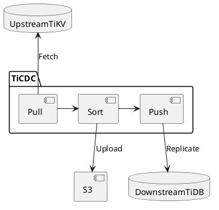
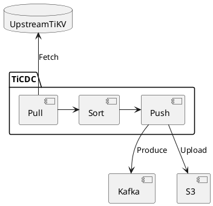
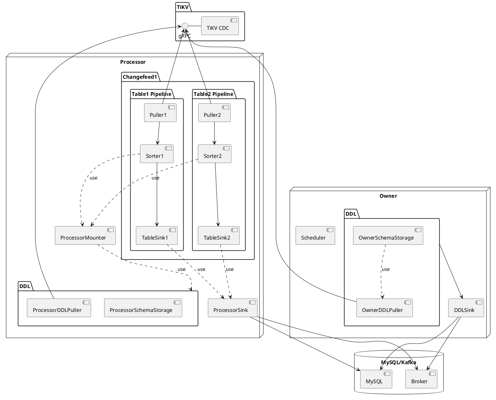
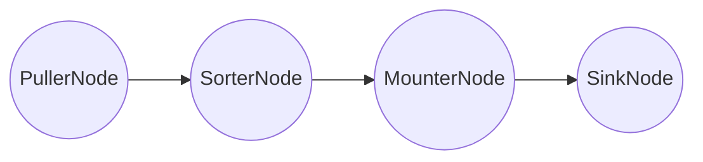
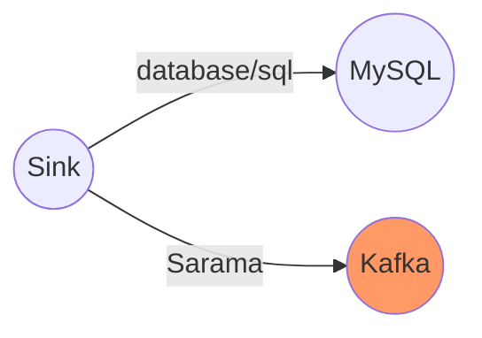

# TiCDC, a tool for replicating the incremental data of TiDB

A Deep Dive

<div class="pt-12">
  <span @click="$slidev.nav.next" class="px-2 py-1 rounded cursor-pointer" hover="bg-white bg-opacity-10">
    Press Space for next page <carbon:arrow-right class="inline"/>
  </span>
</div>

<div class="abs-br m-6 flex gap-2">
  <a href="https://github.com/pingcap/tiflow" target="_blank" alt="GitHub"
    class="text-xl icon-btn opacity-50 !border-none !hover:text-white">
    <carbon-logo-github />
  </a>
</div>

<!--
Hi, My name is rustin. Today we will talk about TiCDC. It is a tool for replicating the incremental data of TiDB.
-->

---
layout: intro
---
# Rustin Liu


<div class="leading-8 opacity-80">
PingCAPer.<br/>
Data Replication Team.<br/>
TiDB Migration Team Committer.<br/>
TiKV Team Reviewer.<br/>
</div>

<div my-10 grid="~ cols-[40px_1fr] gap-y4" items-center justify-center>
  <div i-ri-github-line op50 ma text-xl/>
  <div><a href="https://github.com/hi-rustin" target="_blank">hi-rustin</a></div>
  <div i-ri-twitter-line op50 ma text-xl/>
  <div><a href="https://twitter.com/hi_rustin" target="_blank">hi_rustin</a></div>
  <div i-ri-user-3-line op50 ma text-xl/>
  <div><a href="https://hi-rustin.rs" target="_blank">hi-rustin.rs</a></div>
</div>


<div flex="~ gap2">
</div>

<!--
First, let me introduce myself. I am Rustin Liu, a PingCAPer. I am working on the data replication team. I am also a committer of the TiDB migration team. I am also a reviewer of the TiKV team. You can find me on GitHub, Twitter, and my personal website.
-->

---
layout: center
---

<div text-6xl fw100>
  Agenda
</div>

<br>

<div class="grid grid-cols-[3fr_2fr] gap-4">
  <div class="border-l border-gray-400 border-opacity-25 !all:leading-12 !all:list-none my-auto">

  - TiCDC Architecture + Key Metrics
  - Frequently Asked Questions

  </div>
</div>

<style>
h1 {
  font-size: 4rem;
}
</style>

<!--
Today we will talk about TiCDC. We will talk about the architecture of TiCDC and some key metrics. We will also answer some frequently asked questions.
-->

---
layout: intro
---

# What is CDC? & Why we need TiCDC?

<!--
Before we talk about TiCDC. We must first know what CDC is. The full name of CDC is change data capture. In TiDB, there
are some scenarios we need a CDC to capture the data from TiDB.
-->

---

# Data Disaster Recovery

<br/>

<div class="grid grid-cols-2 gap-4 items-center h-100">
  <div class="object-contain h-full of-hidden">
      <span>Data Consistency</span>
      <br/>
      <span>&nbsp;&nbsp;&nbsp; - No requirement</span>
      <br/>
      <span>&nbsp;&nbsp;&nbsp; - Snapshot consistency(sync-point)</span>
      <br/>
      <span>&nbsp;&nbsp;&nbsp; - Eventual consistency(Redo Log)</span>
      <br/>
      <br/>
      <span>Performance Indicators</span>
      <br/>
      <span>&nbsp;&nbsp;&nbsp; - RPO &lt 10S</span>
      <br/>
      <span>&nbsp;&nbsp;&nbsp; - RTO &lt 5min</span>
  </div>
  <div class="object-contain h-full of-hidden w-full">



  </div>
</div>

<!--
First scenario is data disaster recovery. As you can see, we can fetch data from one TiDB cluster and replicate the data
to another cluster. So some disaster happens, we can just switch our application to use the downstream TiDB
cluster.

And we can store the data in S3 and we can recover the data from S3. There are some requirements for this scenario.
Because we wanna our downstream as an backup. So we need to make sure the data is consistent. There are some levels of
consistency. The first one is no requirement. It means we don't care about the data consistency. The second one is
snapshot consistency. It means we can make sure the data is consistent at a specific point in time. The third one is
eventual consistency. It means we can make sure the data is consistent after a period of time. In TiCDC, we have
a function called sync-point. It can make sure the data is consistent at a specific point in time.

In this scenario, we need to focus on two performance indicators.
The first one is RPO. It means recovery point objective. It means how long we tolerate the data loss. In most cases, we
can guarantee the RPO is less than 10 seconds.

The second one is RTO. It means recovery time objective. It means how long we can recover the cluster to the normal state.
In most cases, we can recover the cluster to the normal state in 5 minutes. In TiCDC, we have a function called
redo log. It can make sure the data is consistent after a period of time.
-->

---

# Data Integration

<br/>

<div class="grid grid-cols-2 gap-4 items-center h-100">
  <div class="object-contain h-full of-hidden">
      <span>Data Format</span>
      <br/>
      <span>&nbsp;&nbsp;&nbsp; - Kafka: Canal-JSON/Avro</span>
      <br/>
      <span>&nbsp;&nbsp;&nbsp; - S3(WIP): CSV</span>
      <br/>
      <br/>
      <br/>
      <span>Performance Indicators</span>
      <br/>
      <span>&nbsp;&nbsp;&nbsp; - Throughput</span>
      <br/>
      <span>&nbsp;&nbsp;&nbsp; - Latency</span>
  </div>
  <div class="object-contain h-full of-hidden w-full">



  </div>
</div>

<!--
The second scenario is data integration. As you can see, we can fetch data from one TiDB cluster and replicate the data
to another system.

We can convert the changed data to different formats. For example, we can convert the changed data to Kafka. And we can
use Canal-JSON or Avro to encode the data. We can also store the data in S3. And we can use CSV to encode the data.

In this scenario, we also need to focus on two performance indicators. The first one is throughput. It means how many
data we can replicate per second. The second one is latency. It means how big the lag is between the upstream and
the downstream.
-->


---
layout: intro
---

# What is TiCDC?

<!--
Now we know why we need a CDC. Let's talk about TiCDC. How does TiCDC work? Let's take a look at the architecture of
TiCDC.
-->
---

<div class="arch">
<div>

# Architecture

</div>

<div
  class="relation"
>

- A TiCDC cluster has only one owner.
- A capture will have multiple processors.
- A processor can only process one changefeed.
- A changefeed can synchronize multiple tables.

</div>

<div>



</div>
</div>

<style>
.arch {
  display: flex;
}

.arch img {
  margin-top: -80px;
}

.relation {
  position: absolute;
  z-index: 1;
  left: 560px;
  top: 100px;
  font-size: 12px;
  color: black;
}

h1 {
  background-color: #2B90B6;
  background-image: linear-gradient(45deg, #4EC5D4 10%, #146b8c 20%);
  background-size: 50%;
  -webkit-background-clip: text;
  -moz-background-clip: text;
  -webkit-text-fill-color: transparent;
  -moz-text-fill-color: transparent;
  writing-mode: vertical-rl;
  text-orientation: mixed;
}
</style>

<!--
As you can see, TiCDC is a TiDB cluster. We call each TiCDC instance a capture. Each capture can have multiple goroutines
to process the data.

We can see there are two types of goroutines. One is the owner. The other one is the processor.
So it is logical concept. You only can have one owner in a TiCDC cluster. But you can have multiple processors.

The owner is responsible for scheduling the tables and executing the DDL.

The processor is responsible for replicating data for a changefeed. Each processor can only process one changefeed.
And a changefeed can replicate multiple tables. So we can see there are multiple pipelines in a processor.

The pipeline is responsible for replicating data for a table. Each pipeline has four components. The first one is the
puller. It is responsible for pulling the data from TiKV. The second one is the sorter. It is responsible for sorting
the data. The third one is the mounter. It is responsible for decoding the data. The last one is the sink. It is responsible
for sending the data to the downstream.

As you can see, the core of TiCDC is the table pipeline. So let's take a look at the table pipeline.
-->

---

# Table Pipeline

Each changefeed creates a processor, and each processor maintains multiple table pipelines.

### Pipeline
<br>
<br>



---

# Data Flow - An Example

<br/>
<br/>
<br/>

<div class="grid grid-cols-2 gap-4 items-center h-100">
  <div class="object-contain h-full of-hidden">

```sql {0|1|3-7|6|8-14|0}
-- Create the following table structure--

CREATE TABLE TEST(
   NAME VARCHAR (20)     NOT NULL,
   AGE  INT              NOT NULL,
   PRIMARY KEY (NAME)
);

+-------+-------------+------+------+---------+-------+
| Field | Type        | Null | Key  | Default | Extra |
+-------+-------------+------+------+---------+-------+
| NAME  | varchar(20) | NO   | PRI  | NULL    |       |
| AGE   | int(11)     | NO   |      | NULL    |       |
+-------+-------------+------+------+---------+-------+
```

  </div>
  <div class="object-contain h-full of-hidden w-full">

```sql {0|1|3-4|6-8}
-- Execute these two DMs in TiDB --

INSERT INTO TEST (NAME,AGE)
VALUES ('Jack',20);

UPDATE TEST
SET AGE = 25
WHERE NAME = 'Jack';

```

  </div>
</div>

---

# Data Flow - Write Data to TiKV

<br/>
<br/>
<br/>

<div class="grid grid-cols-2 gap-4 items-center h-100">
  <div class="object-contain h-full of-hidden">

```sql {0|2-3|4-9|0}

INSERT INTO TEST (NAME,AGE)
VALUES ('Jack',20);

+------------+-----------------+
|      Key   |     Value       |
+------------+-----------------+
| TEST_Jack  |    Jack | 20    |
+------------+-----------------+

```

  </div>
  <div class="object-contain h-full of-hidden w-full">

```sql {0|1-4|5-9}
UPDATE TEST
SET AGE = 25
WHERE NAME = 'Jack';

+------------+-----------------+
|      Key   |     Value       |
+------------+-----------------+
| TEST_Jack  |    Jack | 25    |
+------------+-----------------+

```

  </div>
</div>

---

# Data Flow - Puller

Pull DDL and Row Change data from TiKV.

### Pull two regions
```sql {0|all|0}
+--------------------------------------------+-----------------------------------------------------+
|                   Region1                  |                         Region2                     |
+--------------------------------------------+-----------------------------------------------------+
|                                            |              ts3: Test_Mick -> Mick | 18            |
|       ts2: TEST_Jack ->  Jack | 20         |                                                     |
|       ts2: Resolved                        |                                                     |
|       ts4: TEST_Jack ->  Jack | 25         |              ts3: Resolved                          |
|       ts4: Resolved                        |                                                     |
+--------------------------------------------+-----------------------------------------------------+
```


### The real row change data
```sql {0|all|0}
+-------------+--------------+------------+---------+--------------+------------------+------------------+
|   start_ts  |   commit_ts  |  type      | op_type |    key       |       value      |     old_value    |
+-------------+--------------+------------+---------+--------------+------------------+------------------+
|      1      |       2      | COMMITTED  |   PUT   |   TEST_Jack  |     Jack  | 20   |       null       |
|      3      |       4      | COMMITTED  |   PUT   |   TEST_Jack  |     Jack  | 25   |     Jack  | 20   |
+-------------+--------------+------------+---------+--------------+------------------+------------------+
```

---

# Data Flow - Sorter

### Before
```sql {0|all|0}
+--------------------------------------+-------------- -----------------------------+
|             Region1                  |                Region2                     |
+--------------------------------------+--------------------------------------------+
|                                      |     ts3: Test_Mick -> Mick | 18            |
|    ts2: TEST_Jack ->  Jack | 20      |                                            |
|    ts2: Resolved                     |                                            |
|    ts4: TEST_Jack ->  Jack | 25      |     ts3: Resolved                          |
|    ts4: Resolved                     |                                            |
+--------------------------------------+--------------------------------------------+
```

### After
```sql {0|all}
+--------------------------------------------+
|                   Events                   |
+--------------------------------------------+
|       ts2: TEST_Jack ->  Jack | 20         |
|       ts2: Resolved                        |
|       ts3: Test_Mick ->  Mick | 18         |
|       ts3: Resolved                        |
|       ts4: TEST_Jack ->  Jack | 25         |
|       ts4: Resolved                        |
+--------------------------------------------+
```

---

# Data Flow - Mounter

Mounter will use the schema information to convert the row kv
into row changes that TiCDC can handle.

<br/>
<br/>
<br/>

<div grid="~ cols-2 gap-4">
<div>

```go {all|5,7}
type RawKVEntry struct {
	OpType OpType
	Key    []byte
	// nil for delete type
	Value []byte
	// nil for insert type
	OldValue []byte
	StartTs  uint64
	// Commit or resolved TS
	CRTs uint64
	// Additional debug info
	RegionID uint64
}
```

</div>

<div>

```go {all|9,10}
type RowChangedEvent struct {
	StartTs  uint64
	CommitTs uint64
	RowID int64
	Table    *TableName
	ColInfos []rowcodec.ColInfo
	TableInfoVersion uint64
	ReplicaID    uint64
	Columns      []*Column
	PreColumns   []*Column
	IndexColumns [][]int
	ApproximateDataSize int64
}
```

</div>
</div>

---

# Data Flow - Sink

Sink is responsible for sending data to MySQL/TiDB or Kafka.

<div class="sink">



</div>

<style>
.sink {
  display: flex;
  justify-content: center;
  align-items: center;
}
</style>

---

# Data Flow - Sink

The real SQL or JSON data will be sent to MySQL/TiDB or Kafka.

<br/>

<div class="grid grid-cols-2 gap-4 items-center h-100">
  <div class="object-contain h-full of-hidden">

```sql {0|all|0}
/*
Because there are only Columns,
it is an Insert statement.
*/
INSERT INTO TEST (NAME,AGE)
VALUES ('Jack',20);

/*
Because there are both Columns and PreColumns,
it is an Update statement.
*/
UPDATE TEST
SET AGE = 25
WHERE NAME = 'Jack';

```
  </div>
  <div class="object-contain h-full of-hidden w-full">

```json {0|all}
{
    "id": 0,
    "database": "test",
    "table": "TEST",
    "pkNames": [
        "NAME"
    ],
    "isDdl": false,
    "type": "INSERT",
    ...
    "ts": 2,
    ...
    "data": [
        {
            "NAME": "Jack",
            "AGE": "25"
        }
    ],
    "old": null
}
```

  </div>
</div>


---
layout: intro
---

# Let's check the Data Flow metrics, then you will know the throughput of TiCDC.

---
layout: iframe
url: https://metricstool.pingcap.com/viz/index.html#!/
scale: 0.6
---


---
layout: intro
---

# I get the throughput of TiCDC, but how can I know the latency?

---
layout: iframe
url: https://metricstool.pingcap.com/viz/index.html#!/
scale: 0.6
---

---
layout: intro
---

# Frequently Asked Questions

---
layout: two-cols
---

# Why such a big latency?

<br/>

- Big Transaction
  - Split the big transaction into small ones.(Only v6.1.0+)

- Throughput too low
  - Table Memory Quota
  - Sink Worker Count
  - Upstream TiKV region count (Big single table)
  - High workload on Upstream

::right::

<br/>
<br/>
<br/>

- Upstream issue
  - Region Leader Transfer
  - Resolved TS can not advance

- Downstream issue
  - Downstream database is too slow
  - Write conflict

- Cluster topology
  - Cross-Region Deployment

---

# Why this design?

<br/>

- Data Replication Method
  - Raft Learner VS Raft Log Event

- Data Order
  - Do we really need to keep the order of the data?

- Write method
  - SQL VS Row KV

- Scalability
  - Why scheduler based on table count?

---
layout: center
---

# Thanks!
