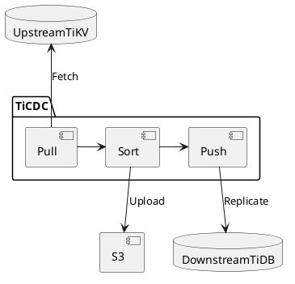
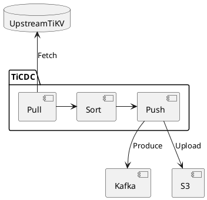
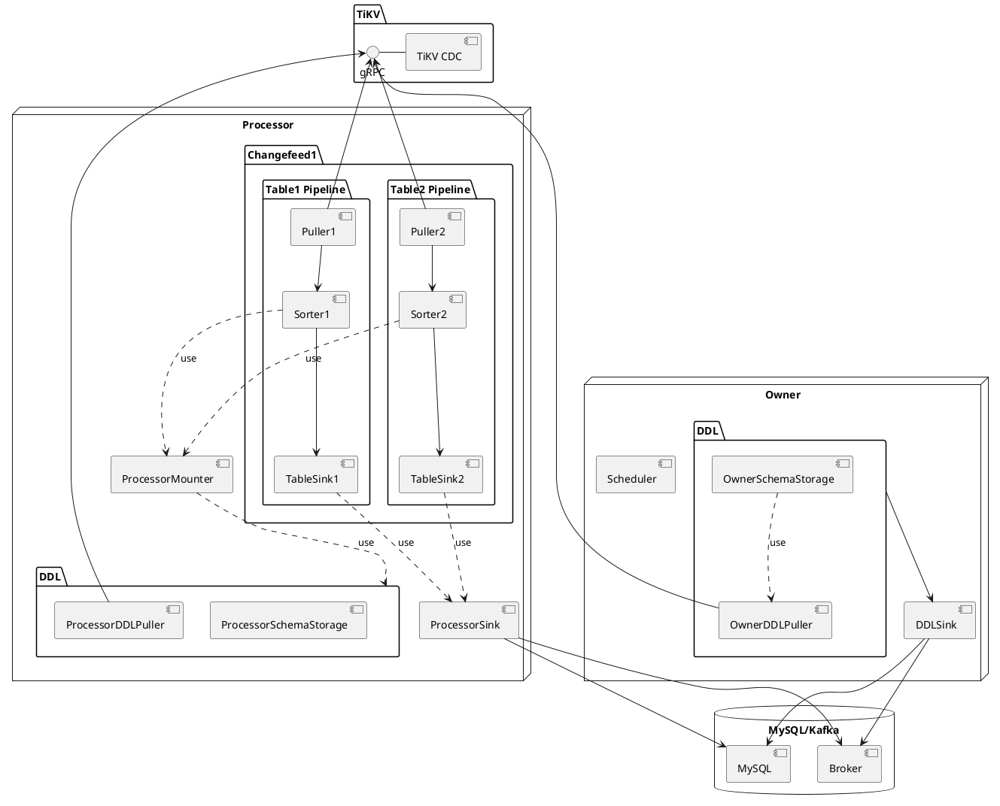
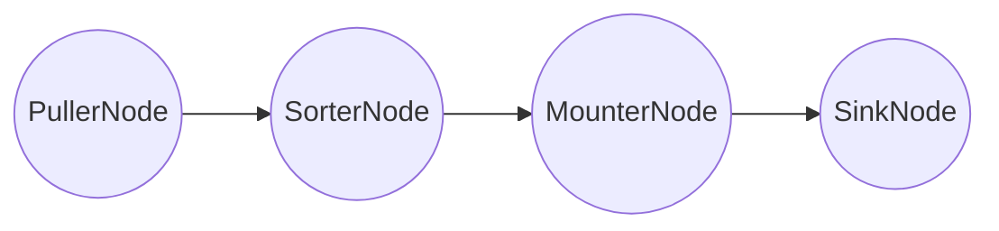
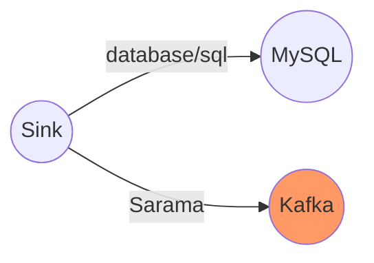

# TiCDC, a tool for replicating the incremental data of TiDB

A Deep Dive

<div class="pt-12">
  <span @click="$slidev.nav.next" class="px-2 py-1 rounded cursor-pointer" hover="bg-white bg-opacity-10">
    Press Space for next page <carbon:arrow-right class="inline"/>
  </span>
</div>

<div class="abs-br m-6 flex gap-2">
  <a href="https://github.com/pingcap/tiflow" target="_blank" alt="GitHub"
    class="text-xl icon-btn opacity-50 !border-none !hover:text-white">
    <carbon-logo-github />
  </a>
</div>

<!--
Hi, My name is rustin. Today we will talk about TiCDC.

It's a tool for replicating the incremental data of TiDB.
-->

---
layout: intro
---
# Rustin Liu


<div class="leading-8 opacity-80">
PingCAPer.<br/>
Data Replication Team.<br/>
TiDB Migration Team Committer.<br/>
TiKV Team Reviewer.<br/>
</div>

<div my-10 grid="~ cols-[40px_1fr] gap-y4" items-center justify-center>
  <div i-ri-github-line op50 ma text-xl/>
  <div><a href="https://github.com/hi-rustin" target="_blank">hi-rustin</a></div>
  <div i-ri-twitter-line op50 ma text-xl/>
  <div><a href="https://twitter.com/hi_rustin" target="_blank">hi_rustin</a></div>
  <div i-ri-user-3-line op50 ma text-xl/>
  <div><a href="https://hi-rustin.rs" target="_blank">hi-rustin.rs</a></div>
</div>


<div flex="~ gap2">
</div>

<!--
First, let me introduce myself. I'm Rustin.
Of course, I'm a PingCAPer. I'm working on the data replication team.
I'm also a committer of the TiDB migration team. I'm also a reviewer of the TiKV team.
You can reach me on GitHub, Twitter, and my personal website. Of course, lark.
-->

---
layout: center
---

<div text-6xl fw100>
  Agenda
</div>

<br>

<div class="grid grid-cols-[3fr_2fr] gap-4">
  <div class="border-l border-gray-400 border-opacity-25 !all:leading-12 !all:list-none my-auto">

  - TiCDC Architecture + Key Metrics
  - Frequently Asked Questions
  - Q&A

  </div>
</div>

<style>
h1 {
  font-size: 4rem;
}
</style>

<!--
Today we'll talk about the architecture of TiCDC and some key metrics.
And I'll also answer some frequently asked questions.
At last, we'll have a Q&A session. So if you have any questions, please feel free to ask in the Q&A session.
-->

---
layout: intro
---

# What is CDC? & Why we need TiCDC?

<!--
Before we talk about TiCDC. We have to know what CDC is first.
The full name of CDC is change data capture. In TiDB, there are some scenarios we need a CDC to capture the data from TiDB and send it to other systems. Like, you know, Kafka or other TiDB.
-->

---

# Data Disaster Recovery

<br/>

<div class="grid grid-cols-2 gap-4 items-center h-100">
  <div class="object-contain h-full of-hidden">
      <span>Data Consistency</span>
      <br/>
      <span>&nbsp;&nbsp;&nbsp; - No requirement</span>
      <br/>
      <span>&nbsp;&nbsp;&nbsp; - Snapshot consistency(sync-point)</span>
      <br/>
      <span>&nbsp;&nbsp;&nbsp; - Eventually consistency(Redo Log)</span>
      <br/>
      <br/>
      <span>Performance Indicators</span>
      <br/>
      <span>&nbsp;&nbsp;&nbsp; - RPO(recovery point objective) &lt 10S</span>
      <br/>
      <span>&nbsp;&nbsp;&nbsp; - RTO(recovery time objective) &lt 5min</span>
  </div>
  <div class="object-contain h-full of-hidden w-full">



  </div>
</div>

<!--
First scenario is data disaster recovery. As you can see, we can fetch data from one TiDB cluster and replicate the data
to another cluster. So some disaster happens, we can just switch our application to use the downstream TiDB
cluster.

Also we can store the data in S3 and we can recover the data from it.

There are some requirements for this scenario. Because we wanna our downstream more useful. Like we can send some read traffic
to the downstream TiDB cluster. So we need to make sure the data is consistent. There are some levels of consistency.

The first one is no requirement. It means we don't care about the data consistency. We just wanna the data as soon as possible.
You can send it randomly.

The second one is snapshot consistency. It means we can make sure the data is consistent at a specific point in time. In TiCDC, we have a function called sync-point to support it. You can choose a specific timestamp and use TiDB's stale read feature to read the data at that timestamp.


The third one is eventually consistency. It means we can make sure the data is consistent after a period of time. In TiCDC, we have a function called redo log to support it. After the disaster happens, we can just replay the redo log to the downstream TiDB cluster.

And in this scenario, we need to focus on two performance indicators.
The first one is RPO(recovery point objective). It means how long we tolerate the data loss. In most cases, we
can guarantee the RPO is less than 10 seconds. It means at most 10 seconds of data loss.

The second one is RTO(recovery time objective.) It means how long we can recover the cluster to the normal state.
In most cases, we can recover it in 5 minutes.
-->

---

# Data Integration

<br/>

<div class="grid grid-cols-2 gap-4 items-center h-100">
  <div class="object-contain h-full of-hidden">
      <span>Data Format</span>
      <br/>
      <span>&nbsp;&nbsp;&nbsp; - Kafka: Canal-JSON/Avro</span>
      <br/>
      <span>&nbsp;&nbsp;&nbsp; - S3(WIP): CSV</span>
      <br/>
      <br/>
      <br/>
      <span>Performance Indicators</span>
      <br/>
      <span>&nbsp;&nbsp;&nbsp; - Throughput</span>
      <br/>
      <span>&nbsp;&nbsp;&nbsp; - Latency</span>
  </div>
  <div class="object-contain h-full of-hidden w-full">



  </div>
</div>

<!--
The second scenario is data integration. As you can see, we can fetch data from one TiDB cluster and replicate the data
to another system. It's can be Kafka, S3, or other systems. Not only a database.

We can convert the changed data to different formats. For example, we can convert the changed data to Kafka message.
And we can use Canal-JSON or Avro to encode the data. We can also store the data in S3. And use CSV to encode the data.
It's very common format.

In this scenario, we also need to focus on two performance indicators. The first one is throughput. It means how many
data we can replicate per second. The second one is latency. It means how big the lag is between the upstream and
the downstream systems.

Some users really care about the latency. Because they wanna the data is as fresh as possible.
-->


---
layout: intro
---

# What is TiCDC?

<!--
Now we know why we need a CDC. Let's talk about TiCDC. We'll take a look at the architecture of
TiCDC.
-->
---

<div class="arch">
<div>

# Architecture

</div>

<div
  class="relation"
>

- A TiCDC cluster has only one owner.
- A capture will have multiple processors.
- A processor can only process one changefeed.
- A changefeed can synchronize multiple tables.

</div>

<div>



</div>
</div>

<style>
.arch {
  display: flex;
}

.arch img {
  margin-top: -80px;
}

.relation {
  position: absolute;
  z-index: 1;
  left: 560px;
  top: 100px;
  font-size: 12px;
  color: black;
}

h1 {
  background-color: #2B90B6;
  background-image: linear-gradient(45deg, #4EC5D4 10%, #146b8c 20%);
  background-size: 50%;
  -webkit-background-clip: text;
  -moz-background-clip: text;
  -webkit-text-fill-color: transparent;
  -moz-text-fill-color: transparent;
  writing-mode: vertical-rl;
  text-orientation: mixed;
}
</style>

<!--
You know, TiCDC is a distributed cluster. We call each TiCDC instance a capture. Each capture can have multiple roles
to process the data.

You can imagine this whole picture as a capture.

We can see there are two types of roles. One is the owner. The other one is the processor.
So it's just logical concept. Not physical concept.


You only can have one owner in a TiCDC cluster. But you can have multiple processors.

The owner is responsible for scheduling the tables and executing the DDL. Because the DDL is a special operation. You can't
execute the DDL multiple times. So we need to make sure the DDL is executed only once. And that's why we need the owner to
execute it.

The processor is responsible for replicating data for a changefeed. Each processor can only process one changefeed.
And a changefeed can replicate multiple tables.

Maybe you have a question. What is the Changefeed? You can think it's just a configuration for some tables. Users can
write a configuration file to describe the changefeed. And then TiCDC will replicate the data for the tables in the
changefeed configuration.

We can see there are multiple pipelines in a processor. The pipeline is responsible for replicating data for a table. Each pipeline has four components.

The first one is the puller. It's responsible for pulling the data from TiKV.

The second one is the sorter. It's responsible for sorting the data.

The third one is the mounter. It's responsible for decoding the data.

The last one is the sink. It is responsible for sending the data to the downstream.

As you can see, the core of TiCDC is the table pipeline. So let's take a deeper look at the table pipeline.
-->

---

# Table Pipeline

Each changefeed creates a processor, and each processor maintains multiple table pipelines.

### Pipeline
<br>
<br>



<!--
The table pipeline looks like a pipe. It's very simple and straightforward.
The data flows from the puller to the sorter, and then to the mounter, and finally to the sink.
So we can go through the pipeline step by step and see how it replicates data.
-->

---

# Data Flow - An Example

<br/>
<br/>
<br/>

<div class="grid grid-cols-2 gap-4 items-center h-100">
  <div class="object-contain h-full of-hidden">

```sql
-- Create the following table structure--

CREATE TABLE TEST(
   NAME VARCHAR (20)     NOT NULL,
   AGE  INT              NOT NULL,
   PRIMARY KEY (NAME)
);

+-------+-------------+------+------+---------+-------+
| Field | Type        | Null | Key  | Default | Extra |
+-------+-------------+------+------+---------+-------+
| NAME  | varchar(20) | NO   | PRI  | NULL    |       |
| AGE   | int(11)     | NO   |      | NULL    |       |
+-------+-------------+------+------+---------+-------+
```

  </div>
  <div class="object-contain h-full of-hidden w-full">

```sql
-- Execute these two DMs in TiDB --

INSERT INTO TEST (NAME,AGE)
VALUES ('Jack',20);

UPDATE TEST
SET AGE = 25
WHERE NAME = 'Jack';

```

  </div>
</div>

<!--
This is an example. We create a table named TEST. It has two columns. The first one is NAME. It is the primary key.
The second one is AGE.

We insert a row into the table. And then we update that row. So we can trace the data flow
in the table pipeline. But before that, let's check the real data structure in TiKV.

By the way. Those two DMLs are executed in different transactions.
-->

---

# Data Flow - Write Data to TiKV

<br/>
<br/>
<br/>

<div class="grid grid-cols-2 gap-4 items-center h-100">
  <div class="object-contain h-full of-hidden">

```sql

INSERT INTO TEST (NAME,AGE)
VALUES ('Jack',20);

+------------+-----------------+
|      Key   |     Value       |
+------------+-----------------+
| TEST_Jack  |    Jack | 20    |
+------------+-----------------+

```

  </div>
  <div class="object-contain h-full of-hidden w-full">

```sql
UPDATE TEST
SET AGE = 25
WHERE NAME = 'Jack';

+------------+-----------------+
|      Key   |     Value       |
+------------+-----------------+
| TEST_Jack  |    Jack | 25    |
+------------+-----------------+

```

  </div>
</div>

<!--
For the insert statement, we can see the key is TEST_Jack. The value is Jack | 20. The key is the table name and the
primary key.

For the update statement, we can see the key is still TEST_Jack. But the value is Jack | 25. So we can see the value is updated.

This just a simplified example. In fact, TiKV uses a more complex key-value structure. But it's not important for
this talk. So we can ignore it.
-->

---

# Data Flow - Puller

Pull DDL and Row Change data from TiKV.

### Pull two regions
```sql {0|all|0}
+--------------------------------------------+-----------------------------------------------------+
|                   Region1                  |                         Region2                     |
+--------------------------------------------+-----------------------------------------------------+
|                                            |              ts3: Test_Mick -> Mick | 18            |
|       ts2: TEST_Jack ->  Jack | 20         |                                                     |
|       ts2: Resolved                        |                                                     |
|       ts4: TEST_Jack ->  Jack | 25         |              ts3: Resolved                          |
|       ts4: Resolved                        |                                                     |
+--------------------------------------------+-----------------------------------------------------+
```


### The real row change data
```sql {0|all|0}
+-------------+--------------+------------+---------+--------------+------------------+------------------+
|   start_ts  |   commit_ts  |  type      | op_type |    key       |       value      |     old_value    |
+-------------+--------------+------------+---------+--------------+------------------+------------------+
|      1      |       2      | COMMITTED  |   PUT   |   TEST_Jack  |     Jack  | 20   |       null       |
|      3      |       4      | COMMITTED  |   PUT   |   TEST_Jack  |     Jack  | 25   |     Jack  | 20   |
+-------------+--------------+------------+---------+--------------+------------------+------------------+
```

<!--
Puller, Let's suppose we have two regions. The first one is
Region1 and it stores the data of the first row. The second one is Region2 and it stores the data of the second
row. It sounds a bit stupid. But it's just for the example.

Puller will pull the data from TiKV. And then it will send the data to the sorter.

As you can see, the real row change data has some extra information.

The first one and the second one are the start_ts and the commit_ts. And we can see it already committed.
Both of them are put operations. Because we insert and update the data, so it's PUT.

Then we can see the key and the value. There also has an old_value. It's the old value before the update. Sometimes
we need it. Like users want to know the old value before the update. So we can keep it and send it to the downstream.
-->

---

# Data Flow - Sorter

### Before
```sql {0|all|0}
+--------------------------------------+-------------- -----------------------------+
|             Region1                  |                Region2                     |
+--------------------------------------+--------------------------------------------+
|                                      |     ts3: Test_Mick -> Mick | 18            |
|    ts2: TEST_Jack ->  Jack | 20      |                                            |
|    ts2: Resolved                     |                                            |
|    ts4: TEST_Jack ->  Jack | 25      |     ts3: Resolved                          |
|    ts4: Resolved                     |                                            |
+--------------------------------------+--------------------------------------------+
```

### After
```sql {0|all}
+--------------------------------------------+
|                   Events                   |
+--------------------------------------------+
|       ts2: TEST_Jack ->  Jack | 20         |
|       ts2: Resolved                        |
|       ts3: Test_Mick ->  Mick | 18         |
|       ts3: Resolved                        |
|       ts4: TEST_Jack ->  Jack | 25         |
|       ts4: Resolved                        |
+--------------------------------------------+
```

<!--
Sorter, It's a very important component. Because we receive the data
from different regions. So the data is not in order. We need to sort the data by the commit_ts for one table.
Because we have to keep some consistency. For example, we can't update the data before the insert.

As you can see, we merge the data from Region1 and Region2. And then we sort the data by the commit_ts.

Also, we can see the Resolved event. It is a special event. It means the data before this event is sent to the
TiCDC. No more data will be sent to the TiCDC which has a smaller commit_ts than this event.

This kind of event like a watermark. It's a very common pattern in the stream processing system. So we can just
imagine TiCDC as a stream processing system but for TiDB. And resolved ts like a signal to tell the TiCDC that
you can move forward.

It's used to advance the progress of the table pipeline. Today I'm not gonna to cover how to calculate the resolved ts.
Because it is too complicated. Maybe next time.
-->

---

# Data Flow - Mounter

Mounter will use the schema information to convert the row kv
into row changes that TiCDC can handle.

<br/>
<br/>
<br/>

<div grid="~ cols-2 gap-4">
<div>

```go {all|5,7}
type RawKVEntry struct {
	OpType OpType
	Key    []byte
	// nil for delete type
	Value []byte
	// nil for insert type
	OldValue []byte
	StartTs  uint64
	// Commit or resolved TS
	CRTs uint64
	// Additional debug info
	RegionID uint64
}
```

</div>

<div>

```go {all|9,10}
type RowChangedEvent struct {
	StartTs  uint64
	CommitTs uint64
	RowID int64
	Table    *TableName
	ColInfos []rowcodec.ColInfo
	TableInfoVersion uint64
	ReplicaID    uint64
	Columns      []*Column
	PreColumns   []*Column
	IndexColumns [][]int
	ApproximateDataSize int64
}
```

</div>
</div>

<!--
Mounter. Because the row kv is not easy to handle.
We have to use the schema information to convert it. We can't directly send a bunch of bytes to the downstream.

As you can see, we have Value and OldValue. We can use the schema information to convert them into Columns and
PreColumns.

This kind of row change structure is easy to handle. We can use it to do the downstream data processing. For example,
we can use it to generate the SQL statement or the Kafka message.
-->

---

# Data Flow - Sink

Sink is responsible for sending data to MySQL/TiDB or Kafka.

<div class="sink">



</div>

<style>
.sink {
  display: flex;
  justify-content: center;
  align-items: center;
}
</style>

<!--
Sink. We can send the data to MySQL/TiDB or Kafka.

We can use the official MySQL driver to send the data to MySQL/TiDB. It's very convenient.

We can use the Sarama as a producer to produce the data to Kafka.

We also have a S3 sink. But it's not ready yet. We will release it in the next version.
-->

---

# Data Flow - Sink

The real SQL or JSON data will be sent to MySQL/TiDB or Kafka.

<br/>

<div class="grid grid-cols-2 gap-4 items-center h-100">
  <div class="object-contain h-full of-hidden">

```sql {0|all|0}
/*
Because there are only Columns,
it is an Insert statement.
*/
INSERT INTO TEST (NAME,AGE)
VALUES ('Jack',20);

/*
Because there are both Columns and PreColumns,
it is an Update statement.
*/
UPDATE TEST
SET AGE = 25
WHERE NAME = 'Jack';

```
  </div>
  <div class="object-contain h-full of-hidden w-full">

```json {0|all}
{
    "id": 0,
    "database": "test",
    "table": "TEST",
    "pkNames": [
        "NAME"
    ],
    "isDdl": false,
    "type": "INSERT",
    ...
    "ts": 2,
    ...
    "data": [
        {
            "NAME": "Jack",
            "AGE": "25"
        }
    ],
    "old": null
}
```

  </div>
</div>

<!--
There are some examples of the real SQL or JSON data. We can see the SQL statement is easy to understand.
We just revert the row change into the SQL statement. Because we have value and old_value, so we can generate
the Update statement.

And the JSON data is also easy to understand. We use the Canal-JSON format. This format developed by Alibaba.
Used by many Chinese companies. We can encode it to a Kafka message and send it to Kafka.

It can be easily decoded by the Flink or other data processing frameworks.
-->


---
layout: intro
---

# Let's check the Data Flow metrics, then you will know the throughput of TiCDC.

<!--
Now you have known the data flow of TiCDC. Let's check the data flow metrics. Then you will know the throughput of TiCDC.
As I said before, the throughput is very important performance indicator.
-->

---
layout: iframe
url: https://metricstool.pingcap.net/viz/index.html#!/
scale: 0.6
---

<!--
This is TiCDC's grafana dashboard. We can see the data flow metrics here. This is a collection for those four components.

The first one is Puller. You can see there are tow kinds of events. One is the kv event. The other one is the resolved event.
The kv event is the data we receive from TiKV. The resolved event is the watermark we receive from TiKV.
If you found the kv event is too less and the resolved event is too much, it means you have a lot of regions on the TiKV.

The second one is Sorter. We sort the data by the commit_ts. And we output the data to the mounter and sink.
And you probably found not only the kv event, but also the resolved event is here. Because the sorter will output the resolved event to advance the sink.

The third one is Mounter. We convert the row kv into row changes. And we output the data to the sink. So it's just output the row changes.

The last one is Sink. We send the data to the downstream. We can see the data is sent to MySQL/TiDB or Kafka. We measure the received events and the flushed events. Because sometimes the data is not sent to the downstream immediately. We have to buffer it. Like if the data have some conflicts, we have to execute them one by one. So it will cause some delay.

We also have a special panel for sorter. Because if we can't write the data to downstream immediately, we have to buffer the data. So we buffer it in disk. We have to measure the disk usage. If the disk usage is too high, it means probably your sink is too slow. A bunch of data is waiting to be sent to the downstream. You should find a way to speed up the sink.
-->

---
layout: intro
---

# You get the throughput of TiCDC, but how do you know the latency?

<!--
Now you have known the throughput of TiCDC. But how do you know the latency?
Users probably just saw a bunch of rows sent to the downstream. But they only care about the difference between the upstream and the downstream.

There are several metrics to measure the latency. Also, these metrics indicate the latency for different parts of the data flow.
-->

---
layout: iframe
url: https://metricstool.pingcap.net/viz/index.html#!/
scale: 0.6
name: "ts"
---

<!--
For the latency, you can focus on this row. We have a lag analyze row. We can see the latency for different parts of the TiCDC.

The first metric is checkpoint ts lag. It's the latency between the upstream and the downstream. If you found the checkpoint ts lag is very big, it means the downstream is too slow. Maybe you have some problems in sink. Maybe the sink throughput is too low.
And maybe there is too many conflicts in the sink. So you should find a way to speed up the sink.

The second metric is resolved ts lag. It is a internal indicator. It's a very complicated metric. Also it's not easy to explain.

It's the lag between the table's resolved ts and the current tso. You know, we received the resolved ts from TiKV. But it's for each region. We have to calculate the minimum resolved ts for the whole table. So this metric is the lag between the minimum resolved ts and the current tso.

We also use it for Redo log and sync point and DDL. But it really difficult to understand. So I'll not talk about it here.

TODO
-->

---
layout: intro
---

# Frequently Asked Questions

<!--
Let's move on to the frequently asked questions.
There are many questions about TiCDC. But we can divide them into two categories.
First, people really care about the latency. They always wanna get lower latency.
Second, some people care about the technical details. They wanna know why TiCDC is designed in this way, not in that way.

So I'm gonna cover these two categories. Let's start with the latency.
-->

---
layout: two-cols
---

# Why such a big latency?

<br/>

- Big Transaction
  - Split the big transaction into small ones.(Only v6.1.0+)

- Throughput too low
  - Table memory quota
  - Sink worker count
  - Upstream TiKV region count (Big single table, 20w+ regions)
  - High workload on Upstream

::right::

<br/>
<br/>
<br/>

- Upstream issue
  - Region Leader Transfer
  - Resolved TS can not advance

- Downstream issue
  - Downstream database is too slow
  - Write conflict

- Cluster topology
  - Cross-Region Deployment

<!--
There are many reasons for the high latency.

Let's start with the big transaction. If the transaction is too big, it will take a long time to replicate it to the downstream.
So it will cause a big latency. Because we need to keep the transaction consistency. We have to wait for the whole transaction to be replicated to the downstream.

We can split the big transaction into small ones to get better performance and better control of the memory usage.
But this feature is only available in v6.1.0+.

The second reason is the throughput is too low. We can increase the throughput by increasing the table memory quota. As I said before, we replicate the data by table. So we need to control the memory usage of each table. This is a configuration for each table.
The default quota is 10MB. You can increase it to get a higher throughput if you have enough memory.

You can also increase the sink worker count to get a higher throughput. This is a configuration for the Sink. In TiCDC, we have multiple sink workers. We can send the data parallelly if there are no conflicts. So we can increase the sink worker count to get better performance. Because more workers can send the data to the downstream at the same time.

The TiKV region count is also an important factor. If we have too many regions, it will cause TiCDC spends too much time to deal with the Resolved TS. We speed a lot of CPU to deal with the Resolved TS, then we can't deal with the kv event.
So it will cause a big latency. For now we can't solve this problem. We will improve it in the future.

Also, if your workload is too high on the upstream, it will cause a big latency. Because TiCDC just can't catch up with the upstream.

There are also some upstream issues. For example, the region leader transfer. If the region leader transfer happens too frequently, it probably causes a big latency. Because TiCDC needs to re-connect to the new leader. And the Resolved TS can not advance. If the Resolved TS can not advance, it will cause a big latency.

Sometime if your TiDB cluster is crashed, it probably causes a big latency. Because it may leave some locks on the TiKV. And the
resolved TS can not advance. If the locks exist for a long time, it will cause a big latency. But TiCDC will try to resolve the locks if it can.

There are also some downstream issues. For example, if the downstream database is too slow, it will cause a big latency. Because TiCDC can not send the data to the downstream at a high speed. Also, if there are too many write conflicts, it will cause a big latency. Because TiCDC needs to retry the write operation again and again. Like, if you use TiCDC to replicate the data and at the same time you have some workload on the downstream. It probably causes a lot of conflicts.

The last reason is the cluster topology. If you deploy TiCDC in a cross-region deployment, you should consider the network issue. We need to keep low latency between the upstream and the downstream. Sometimes putting TiCDC in the same region with the downstream is a good choice. It helps to reduce the replication latency.

That's most of the reasons for the latency. Let's move on to the technical details.
-->

---

# Why this design?

<br/>

- Data Replication Method
  - Raft Learner Vs. Raft Log Event

- Data Order
  - Do we really need to keep the order of the data?

- Write method
  - SQL Vs. Row KV

- Scalability
  - Why scheduler based on table count?

<!--
There are several technical details. A lot of users argue about the design of TiCDC. So I'm gonna cover them.

Let's start with the data replication method. We can use the Raft Learner to replicate the data. Or we can use the Raft Log Event to replicate the data. We choose the latter one.

Because as I said before, we need to consider the data integration and also provide different consistency guarantees. So we can't simply use the Raft Learner. Also if you wanna send the data to Kafka, you still have to deal with the schema information.
And convert the data, not just send the raw data.

And I think there are no big performance difference between those two methods. So we choose the Raft Log Event.

About the data order, many people care about the data order but many people don't. So recently we are discussing whether we should keep the data order by default.
Like some users use Kafka, they don't care about the data order. Because maybe they reorder it by themselves.
So maybe we can make it optional in the future.

About the write method, we choose the SQL method. Because it is easy to extend. For example, we can replicate the data to the any MySQL compatible database. So we choose the SQL method instead of the Row KV method. It more flexible.

The last question is about the scalability. Why we schedule the tables based on the table count? Because as you can see, we replicate the data by table. So we simply schedule the tables based on the table count. It's easy to understand and easy to implement.

But sometimes we suffer from the uneven workload. For example, if we have a big table and a small table on same capture. The big table or hot table will occupy most of the resources. And TiCDC treats them equally. It's not make sense. So we are also discussing how to improve it in the future.

Maybe we can schedule the tables based on the workload. It's more reasonable. But it's not easy to implement. So we are still discussing it.

Maybe we can split the table and replicate the data on different TiCDC instances. It's also a good choice. But it's extremely hard to implement. So please stay tuned. We will improve it in the future.
-->

---
layout: center
---

# Q&A

<br/>
<br/>

## Do you have any questions?

<!--
Thanks for your listening.

Let's move on to the Q&A session. Do you have any questions?
-->
